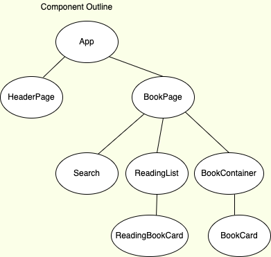

# Book Explorer - Book Finder Tool

Book Explorer is intended to be used by individuals to search books and store books in a personalized reading list.

## User Features

- Search book via book title
- Add books to a reading list

## Technologies & API(s)

# Languages:

- React (JavaScript)
- CSS
- HTML

# API(s):

- Google Books

# Libraries & Server/Database Tools Used

- Semantic UI (frontend)

# Component Tree

